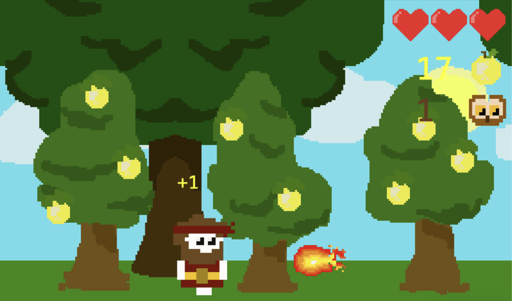
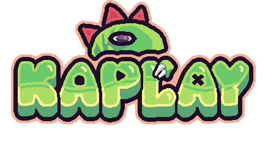

# POMDOR
## Description
Ce jeu permet d'incarner Hercule au Jardin des Hespérides. Il doit sauter pour cueillir des pommes et éviter des boules de feu.

## Librairie de jeu utilisée
Ce jeu a été développé avec [Kaplay](https://kaplayjs.com/).

## Comment jouer?
Téléchargez l'archive `hercule-JV2D`, décompressez-là et ouvrez le dossier dans VSCode. Ouvrez le fichier `index.html`avec _Live Server_.
## Attributions
### Assets graphiques
Tous les dessins ont été réalisés par moi-même (@thea-14) sur [Piskel](https://www.piskelapp.com/).
### Assets sonores
* __Musique de fond (histoire)__: par TAD de OpenGameArt, [écouter ici](https://opengameart.org/content/8-bit-lofi-ice-cave)
* __Musique de fond (jeu)__: par Zane Little Music de OpenGameArt, [écouter ici](https://opengameart.org/content/sunny-day-day-6)
* __Game over__: par sauer2 de OpenGameArt, [écouter ici](https://opengameart.org/content/oldschool-win-and-die-jump-and-run-sounds)
* __Victoire__: par jkfite01 de OpenGameArt, [écouter ici](https://opengameart.org/content/victory-2) (CC-BY 3.0)
* __Clic__: par pauliuw de OpenGameArt, [écouter ici](https://opengameart.org/content/click-sounds6)
* __Saut__: par dklon de OpenGameArt, [écouter ici](https://opengameart.org/content/platformer-jumping-sounds) (CC-BY 3.0)
* __Pomme récoltée__: par Luke.RUSTLTD de OpenGameArt, [écouter ici](https://opengameart.org/content/10-8bit-coin-sounds)
* __Hercule touché__: par sauer2 de OpenGameArt, [écouter ici](https://opengameart.org/content/oldschool-win-and-die-jump-and-run-sounds)
* __Vol de chouette__: par Clusman de Freesound, [écouter ici](https://freesound.org/people/Clusman/sounds/543118/)
* __Collision entre chouette et boule de feu__: par Vircon32 de OpenGameArt, [écouter ici](https://opengameart.org/content/retro-game-sound-effects) (CC-BY 4.0)
* __Rire de Nérée__: par WeaponGuy de OpenGameArt, [écouter ici](https://opengameart.org/content/sinister-laugh)
* __Grognement de Nérée__: par Ogrebane de OpenGameArt, [écouter ici](https://opengameart.org/content/monster-sound-effects-pack)

### Fichier `loquace.js`
Les modifications apportées au fichier `loquace.js` sont de ColinLug, sauf le son "click" qui est un ajout de ma part.
## Recours aux LLMs
Aucun code ni partie de code n'a été généré par un LLM. En revanche, ChatGPT a été utilisé de façon ponctuelle pour réparer des bugs et répondre à des questions de syntaxe.
## Contexte de développement
Ce jeu a été développé dans le cadre du cours "Développement de jeux vidéo 2D" donné par Loïc Cattani au semestre de printemps 2026 à l'Université de Lausanne.

## Remerciements
À Loïc Cattani et Isaac Pante pour leur encadrement et conseils, en présence ou à distance. Un grand merci à Colin pour sa disponibilité et son aide généreuse, ce jeu lui doit beaucoup.

